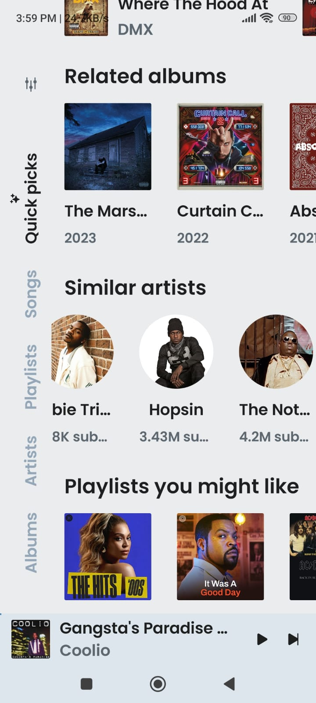
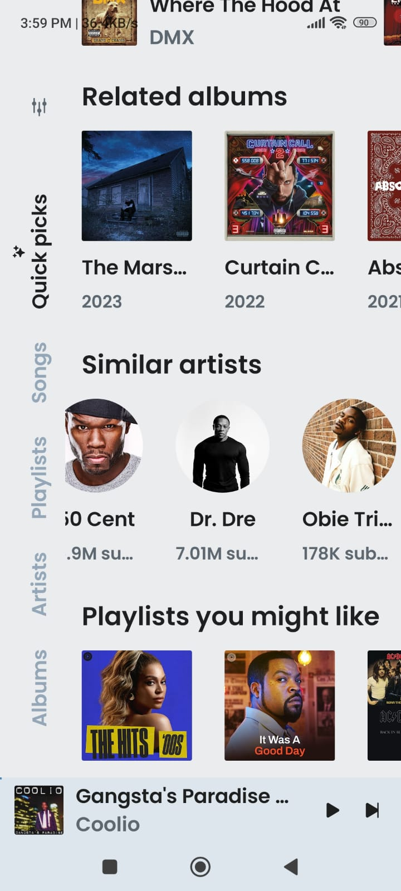
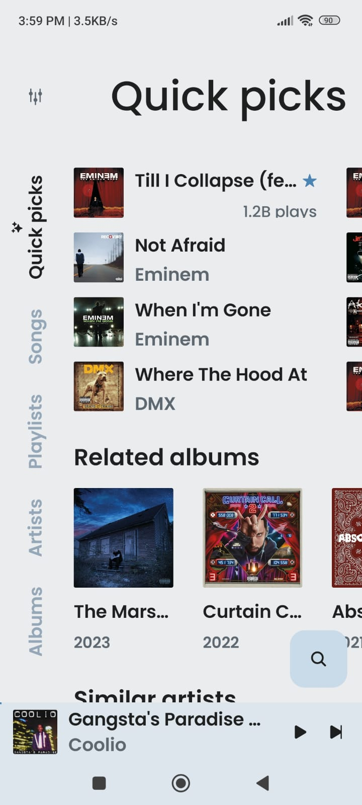
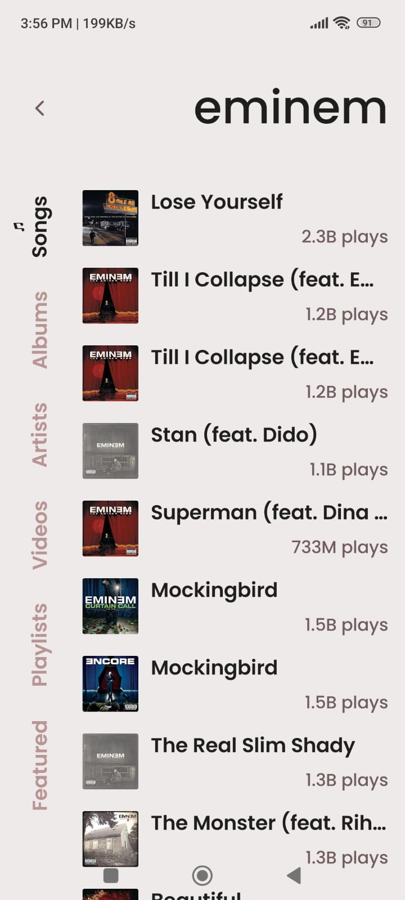
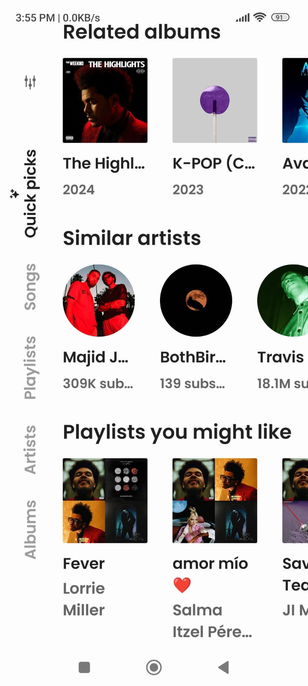
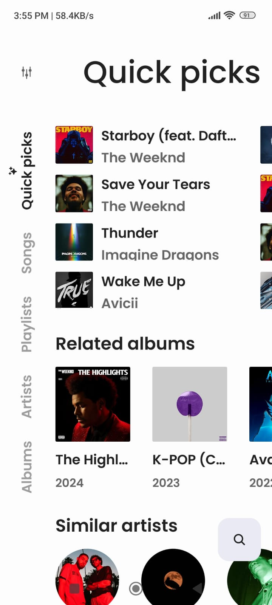

# Music Streamer

An Android application for streaming music from YouTube Music with advanced features for a seamless listening experience.

## Screenshots

<p float="left">
  
   
   
   
   
   
</p>


## Features

- **Play (almost) any song or video** from YouTube Music.
- **Background playback** for uninterrupted music while using other apps.
- **Cache audio chunks** for offline playback.
- **Search functionality** for songs, albums, artists, videos, and playlists.
- **Bookmark artists and albums** to easily access your favorites.
- **Import playlists** to enjoy your pre-made collections.
- **Fetch, display, and edit lyrics** for songs, including synchronized lyrics.
- **Local playlist management** for organizing your music.
- **Reorder songs** in playlists or the queue.
- **Light/Dark/Dynamic theme** support to match your preferences.
- **Skip silence** in tracks for a smoother listening experience.
- **Sleep timer** to automatically stop playback after a set time.
- **Audio normalization** to maintain consistent volume levels.
- **Android Auto** integration for use while driving.
- **Persistent queue** to remember your song order across sessions.
- **Open YouTube/YouTube Music links** for watching videos, viewing playlists, or exploring channels directly in the app.

## Installation  Download and Install APK 
 [Link to Download ](https://dolkeshubhankar.wixsite.com/musicmatchapp-1)

1. **Clone the repository**:
   ```bash
   git clone https://github.com/ShubhankarDolke/MusicMatchApp.git
  
